# CBMC Performance Debugging
<!-- START doctoc generated TOC please keep comment here to allow auto update -->
<!-- DON'T EDIT THIS SECTION, INSTEAD RE-RUN doctoc TO UPDATE -->
**Table of Contents** 

- [CBMC Profiling and Metric Collection](#cbmc-profiling-and-metric-collection)
  - [CBMC background](#cbmc-background)
  - [Runtime Profiling](#runtime-profiling)
  - [Metric Collection](#metric-collection)
    - [Byte Extracts and Updates](#byte-extracts-and-updates)
    - [Solver Query Complexity](#solver-query-complexity)
    - [Pointer Alias Analysis](#pointer-alias-analysis)
    - [Memory Operation Calls](#memory-operation-calls)
    - [Array Constraints](#array-constraints)
- [Strategies for performance optimization](#strategies-for-performance-optimization)
  - [Reducing array constraints](#reducing-array-constraints)
  - [Pruning total points-to set size](#pruning-total-points-to-set-size)
  - [Using clause report to identify code hotspots](#using-clause-report-to-identify-code-hotspots)
  - [Comparing metric data across multiple proofs](#comparing-metric-data-across-multiple-proofs)

<!-- END doctoc generated TOC please keep comment here to allow auto update -->

	
## CBMC Profiling and Metric Collection

### CBMC background

CBMC is a bounded model checker for C and C++ programs. It’s a static analysis tool that allows verifying buffer overflows, pointer safety and user defined specs. Verification is performed by converting the C program into a Boolean formula after unwinding program loops. This is then fed to a decision procedure which looks for an assignment of values that satisfies the formula. In then event that the formula is satisfiable, it indicates the presence of bugs and CBMC provides a counter example trace. Conversely, if the formula is unsatisfiable, we prove the program to be correct within the bound of verification. 


### Runtime Profiling

This provides runtime for the following stages of CBMC:
1. Symex: To convert C program into a boolean formula, the C code is first converted into a goto-program. This is symbolically executed to generate equations in static single assignment (or SSA) form.
1. SSA to SAT: SSA equations are converted to corresponding clauses. A conjunctions of these clauses forms the boolean CNF formula.
1. Post Processing: CBMC may add additional clauses that require global knowledge of the formula, for instance, constraints pertaining to array theory.
1. Solver: The final formula is fed to a SAT solver which is called iteratively to look for a solution to the boolean formula.

### Metric Collection
#### Byte Extracts and Updates

   CBMC uses these operations while dealing with structured data cast from an array of bytes.
   ```
    typedef unsigned char BYTE; 
    int main()
    {
      unsigned int value;
      BYTE* bp = (BYTE*)(&value); 

      bp[0] = bp[2];
      return 0;
    }
   ```
  The operations are often expensive especially when you have variable offsets, source and destination size or a non constant amount of data being extracted. A side effect is reduced constant propagation which could also be a factor for why the resulting SAT formula is expensive to solve.

  **Data collected**
  1. Number of byte extract and byte update operations
  1. Exact source location for each byte extract or update
  1. SSA expression encoding a byte extract or update

  >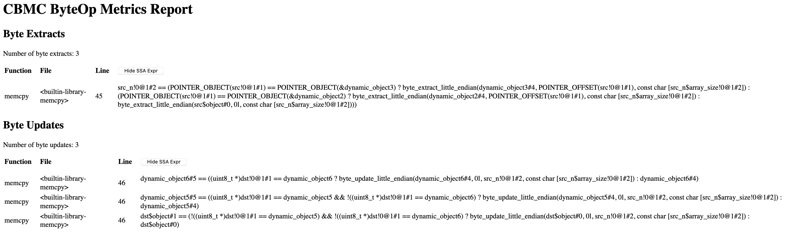

#### Solver Query Complexity

  Although the size of the formula and runtime are weakly correlated, this provides information that's crucial to identify where majority of the clauses come from. Additionally, clauses in the UNSAT core are mapped to actual program instructions that generate them. A mapping of both in and out of core clauses can help identify code hotspots and any redundant clauses that can be eliminated. 

  **Data collected**
  1. Number of clauses, variables and literals for each goto-instructions
  1. SSA expression corresponding to an instruction
  1. Instructions that contribute clauses to the UNSAT core
  1. Lines of code that have no instructions contributing to the core

  >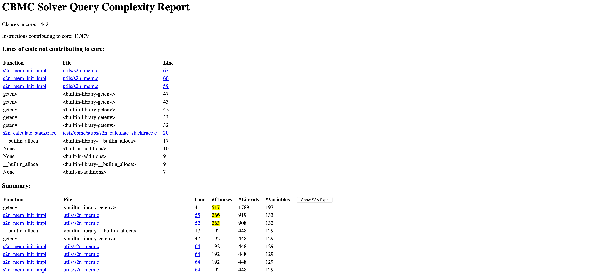

#### Pointer Alias Analysis

  CBMC implements two versions of data pointer analysis. The cbmc call doesn't explicitly care about pointer aliasing but looks at the points-to information for dereferencing. Every data pointer dereference is replaced by an SSA expression encoding all possible memory locations the data pointer points-to. It is performed during symbolic execution and is context sensitive. 

  **Data collected**

  For each data pointer :
  1. Number of pointer dereferences
  1. Size of points-to set
  1. Contents of points-to set
  1. SSA expression encoding pointer dereference case split

  >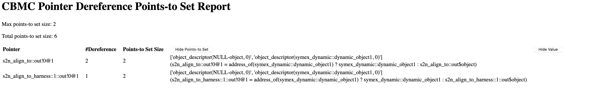

#### Memory Operation Calls

  The metric tracks calls to memory operations: `memcpy`, `memcmp`, `memccpy`, `memmove`, `memchr` and `memset`. These functions may increases proof runtime, mainly because of the complexity of the byte extracts and updates they perform. They are often replaced by stubs that ensure memory safety and over-approximate desired behaviour to improve performance.  

  **Data collected**

  For each memory operation call :
  1. Source location of the call
  1. Goto instruction corresponding to the call

  >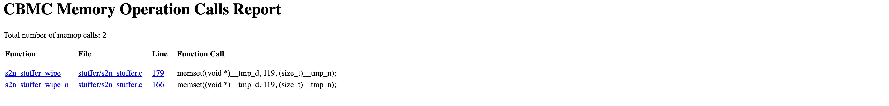

#### Array Constraints

  During post-processing, CBMC adds array constraints that require some global knowledge of the formula, ex. encoding arrays into uninterpreted functions. The metric has a strong correlation with post-processing runtime.

  **Data collected**
  1. Number of different types of array constraints

  >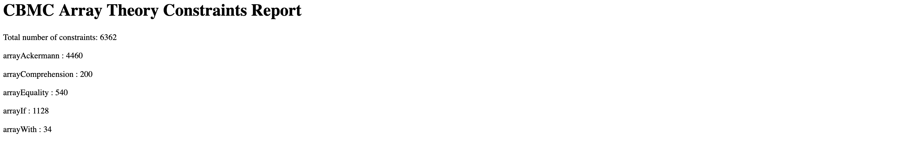

## Strategies for performance optimization

### Reducing array constraints

  The number of array constraints have a direct correlation with post-processing runtime. Goal here is to reduce the number of constraints wherever possible. 

  For example: existing stubs for [memcpy](https://github.com/awslabs/aws-c-common/blob/master/verification/cbmc/stubs/memcpy_override_havoc.c#L25) havoc one element of the destination `dst` pointer
  ```
    if (n > 0) {
        size_t index;
        __CPROVER_assume(index < n);
        ((uint8_t *)dst)[index] = nondet_uint8_t();
    }

  ```
  This can be replaced with `__CPROVER_havoc_object(dst)` which is not only a more sound over-approximation that also eliminates any array constraints added corresponding to `((uint8_t *)dst)[index] = nondet_uint8_t();`.

  Note: The `__CPROVER_havoc_object(void *)` function havocs the object as a whole.
  
  For instance:
  ```
    struct {int i,j;} foo = {1, 2};
    __CPROVER_havoc_object(&foo.i);
    __CPROVER_assert(foo.i == 1); //fails
    __CPROVER_assert(foo.j == 2); //fails
  ```

### Pruning total points-to set size

  There are two factors that may contribute to high runtime: a large points-to set for a data pointer and nested dereferencing of pointers.

  **Pruning set size**

  This is more intuitive as larger the set size more complx is the case split generated for pointer dereferencing. If it can be established that the pointer points-to a specific location in memory, the points-to set can be pruned by explicitly telling CBMC what the pointer points-to using `__CPROVER_assume`.

  For instance: This is a code snippet from the [addHeader](https://github.com/markrtuttle/aws-iot-device-sdk-embedded-C/blob/jeppu-slow-http-initialize/libraries/standard/http/src/http_client.c#L1118) function in [FreeRTOS HTTP](https://github.com/FreeRTOS/coreHTTP/tree/2631204ee9b6a3e2068b0d59c3a6c2d1144628ea) module.
  ```
    static HTTPStatus_t addHeader( HTTPRequestHeaders_t * pRequestHeaders,
                                   const char * pField,
                                   size_t fieldLen,
                                   const char * pValue,
                                   size_t valueLen )
    {
      HTTPStatus_t returnStatus = HTTP_SUCCESS;
      char * pBufferCur = ( char * ) ( pRequestHeaders->pBuffer + pRequestHeaders->headersLen );
      size_t toAddLen = 0u;
      size_t backtrackHeaderLen = pRequestHeaders->headersLen;

      assert( pRequestHeaders != NULL ); // holds true -> use this information to prune points-to set
      ...
    }
  ```
  The assertion `assert( pRequestHeaders != NULL );` holds true here but the points-to set for `pRequestHeaders` in this function is given by `['object_descriptor(NULL-object, 0)', 'object_descriptor(symex_dynamic::dynamic_object1, 0)']` indicating that the data pointer points to a `NULL` object or a dynamically allocated object.

  >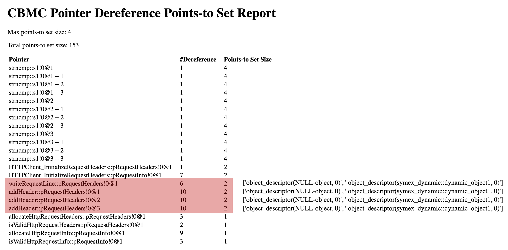

  Since, the assertion holds true, we can safely assume the pointer is not `NULL` by adding `__CPROVER_assume(pRequestHeaders != NULL);` after the assert. This not only prunes the points-to set but also enables constant propagation as the data pointer `pRequestHeaders` now points-to a single object. This reduces the number of dereferences of the `pRequestHeaders` pointer, thereby bringing down overall proof complexity.

  >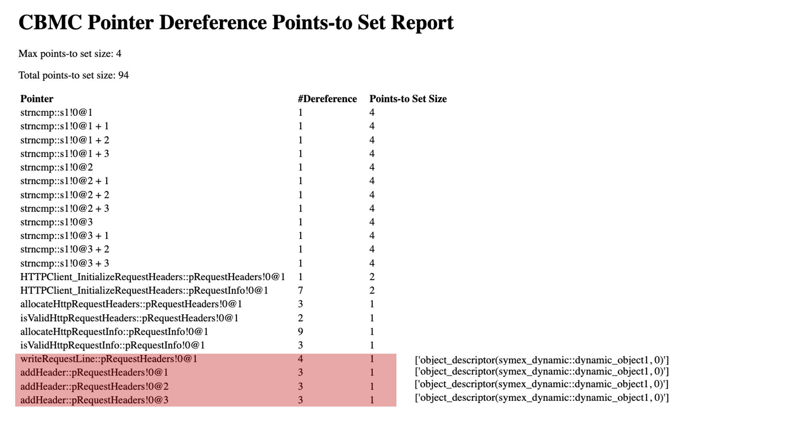

  **Handling nested dereferences**

  Nested dereferences of data pointers can be expensive as they generate complex case splits.
  For instance: here is the code snippet for [s2n_stuffer_reservation_is_valid](https://github.com/natasha-jeppu/s2n/blob/without_opt/stuffer/s2n_stuffer.c#L38) function from the [s2n](https://github.com/awslabs/s2n) proof modules.
  ```
    bool s2n_stuffer_reservation_is_valid(const struct s2n_stuffer_reservation* reservation)
    {
      return S2N_OBJECT_PTR_IS_READABLE(reservation) &&
             s2n_stuffer_is_valid(reservation->stuffer) &&
             S2N_MEM_IS_WRITABLE(reservation->stuffer->blob.data + reservation->write_cursor, reservation->length);
    }
  ```
  The [s2n_stuffer_write_reservation](https://github.com/natasha-jeppu/s2n/blob/without_opt/tests/cbmc/proofs/s2n_stuffer_write_reservation/s2n_stuffer_write_reservation_harness.c) proof take **5hrs** with this implementation. The pointer alias analysis metric indicates **2656** dereferences of the `reservation` pointer in this function.

  >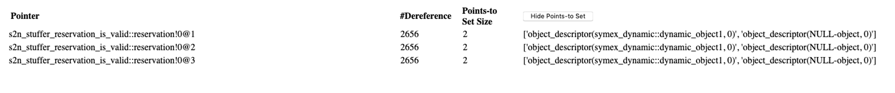

  A useful tool to narrow down the cause for such a high number of dereferences is delta debugging. You can try modifying the code and comparing metric reports. Here are a few modifications for this example and the corresponding metrics:
  ```
    bool s2n_stuffer_reservation_is_valid(const struct s2n_stuffer_reservation* reservation)
    {
      return S2N_OBJECT_PTR_IS_READABLE(reservation) &&
             s2n_stuffer_is_valid(reservation->stuffer);
    }
    // number of pointer dereferences for reservation = 1
  ```
  ```
    bool s2n_stuffer_reservation_is_valid(const struct s2n_stuffer_reservation* reservation)
    {
      return S2N_OBJECT_PTR_IS_READABLE(reservation) &&
             s2n_stuffer_is_valid(reservation->stuffer) &&
             (reservation->stuffer->blob.data != NULL)
    }
    // number of pointer dereferences for reservation = 16
  ```
  From the above changes it is clear that the nested dereferencing `reservation->stuffer->blob.data` contributes 15 dereferences. It is also clear that a majority of the 2656 dereferences comes from `S2N_MEM_IS_WRITABLE(reservation->stuffer->blob.data + reservation->write_cursor, reservation->length);` (line [42](https://github.com/natasha-jeppu/s2n/blob/without_opt/stuffer/s2n_stuffer.c#L42) in stuffer.c). 

  The SSA expression generated for this instruction along with the corresponding number of clauses can be viewed in the solver query complexity report. The report reveals >10,000 clauses for this line and the SSA expression shows the complex case split that is generated to handle nested dereferencing of `reservation` which could be the cause for the high number of dereferences and the runtime.  
  
  >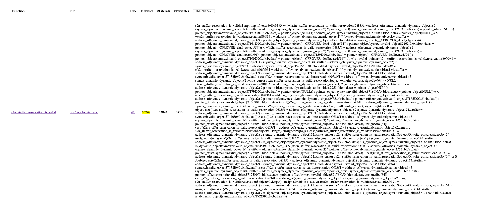

  Looking at these metrics, one obvious potential optimization is reducing number of pointer dereferences. For this, replace dereferences of `reservation` with temporary variables storing the dereferenced value like so:
  ```
    bool s2n_stuffer_reservation_is_valid(const struct s2n_stuffer_reservation* reservation)
    {
      if (!S2N_OBJECT_PTR_IS_READABLE(reservation))
        return false;

      const struct s2n_stuffer_reservation reservation_obj = *reservation;
      if (!s2n_stuffer_is_valid(reservation_obj.stuffer))
        return false;

      const struct s2n_stuffer stuffer_obj = *(reservation_obj.stuffer);

      return S2N_MEM_IS_WRITABLE(stuffer_obj.blob.data + reservation_obj.write_cursor, reservation_obj.length);
    }
  ```
  With this semantically identical but syntactically different code construct, the proof now takes **5mins** to solve. The number of pointer dereferences for `reservation` go down to 1. 

  >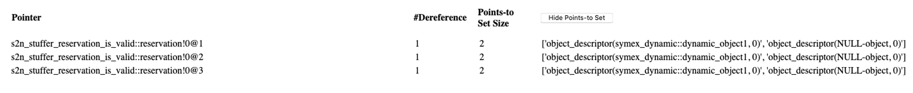

  The solver query complexity report also shows a reduced number of clauses for `S2N_MEM_IS_WRITABLE(stuffer_obj.blob.data + reservation_obj.write_cursor, reservation_obj.length);` (line [49](https://github.com/natasha-jeppu/s2n/blob/with_opt/stuffer/s2n_stuffer.c#L49) in stuffer.c) and the complex case split is now eliminated as well.

  >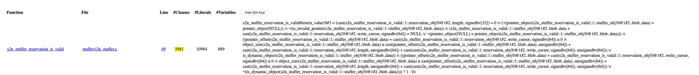

  Although we may not always see a correlation between points-to set metric and runtime, a combination of this metric with solver query complexity metrics is useful to find possible optimizations.

### Using clause report to identify code hotspots

  The number of clauses for an instruction and runtime may not always correlate but the SSA expression corresponding to the instructions gives an intuition of the complexity. A useful tool here is targeted delta debugging. The report highlights instructions that contribute to the UNSAT core so commenting out lines of code that have a large number of clauses in the UNSAT core helps verify if the clauses actually contribute to runtime. See [Pruning total points to set size](#pruning-total-points-to-set-size) for how we use this metric in addition to points-to set to debug performance.

  **Functional coverage analysis**

  A metric that's useful here is the lines of code that don't contribute any clauses to the core. In most cases these correspond to two types of instructions:
  1. Assignment statements or function returns, where the information from the line is propagated to subsequent line of code where they indirectly contribute to the UNSAT core. 
  1. Calls to pre and post condition checks, where the check is already taken care of in the harness or the calling function, so these are flagged as not contributing although equivalent clauses are already added into the UNSAT core through the assertions and assumes in the calling function. 

  For instructions that don't fall into either category mentioned above but are executed (code coverage shows that the line is covered), to verify if the reported lines contribute to the UNSAT core, comment the specific line out and check the proof outcome. If the proof outcome is not affected it indicates a functional coverage hole as the specifications are not complete. Note here the UNSAT core corresponds to the core generated by the specifications in the proof harness.

  For instance: here is the clause report for [aws_byte_buf_append_dynamic](https://github.com/awslabs/aws-c-common/tree/master/verification/cbmc/proofs/aws_byte_buf_append_dynamic) from the [aws-c-common](https://github.com/awslabs/aws-c-common) proof module.

  >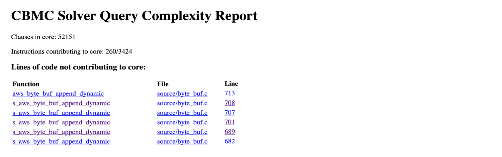

  As per the report, line [701](https://github.com/natasha-jeppu/aws-c-common/blob/8e6387ec8873d596bb1e54cfd85717e818e85d23/source/byte_buf.c#L701) in byte_buf.c does not contribute any clauses to the core. This corresponds to the call to `memcpy` that copies bytes to the end of the buffer.
  ```
    if (from->len > 0) {
      /* This assert teaches clang-tidy that from->ptr and to->buffer cannot be null in a non-empty buffers */
      AWS_ASSERT(from->ptr); // contributes to core
      AWS_ASSERT(to->buffer); // contributes to core
      memcpy(to->buffer + to->len, from->ptr, from->len); // executed; but does not contribute to core
    }
  ```

  The memcpy function is a stub implementation that ensures memory safety and havocs the destination pointer to improve proof runtime.
  ```
    void *memcpy_impl(void *dst, const void *src, size_t n) {
      __CPROVER_precondition(
        __CPROVER_POINTER_OBJECT(dst) != __CPROVER_POINTER_OBJECT(src) ||
            ((const char *)src >= (const char *)dst + n) || ((const char *)dst >= (const char *)src + n),
        "memcpy src/dst overlap");
      __CPROVER_precondition(src != NULL && __CPROVER_r_ok(src, n), "memcpy source region readable");
      __CPROVER_precondition(dst != NULL && __CPROVER_w_ok(dst, n), "memcpy destination region writeable");

      __CPROVER_havoc_object(dst);
      return dst;
    }

    void *memcpy(void *dst, const void *src, size_t n) {
      return memcpy_impl(dst, src, n);
    }
  ```
  Looking at the [harness](https://github.com/natasha-jeppu/aws-c-common/blob/8e6387ec8873d596bb1e54cfd85717e818e85d23/verification/cbmc/proofs/aws_byte_buf_append_dynamic/aws_byte_buf_append_dynamic_harness.c#L25), when the append is successful, there is no check to see if the copied bytes match.
  ```
  if (aws_byte_buf_append_dynamic(&to, &from) == AWS_OP_SUCCESS) {
        assert(to.len == to_old.len + from.len); // missing specification -> assert_bytes_match(...)
    } else {
        /* if the operation return an error, to must not change */
        assert_bytes_match(to_old.buffer, to.buffer, to.len);
        assert(to_old.len == to.len);
  }
  ```

  The specification was excluded here as the destination in memcpy is havoc'ed, in an attempt to improve runtime, so the assertion would not hold true. This explain why the clauses from `memcpy` don't contribute to the UNSAT core defined by the existing specifications in the harness. Similar stubs are introduced all the time as a tradeoff between performance and functional coverage. Using the clause metrics you can identify and track functional coverage holes, like the one above, for subsequent proof iterations.

### Comparing metric data across multiple proofs

  Proof harness are continuously added as the codebase grows and it if often seen that optimizations applied to similar proofs are not incorporated in the new ones. Comparing metric data for similar proofs helps identify these optimizations.

  A consolidated report, like the one below, with metric data for multiple proofs is generated that makes it easy to analyse similar proofs and compare metric information.

  >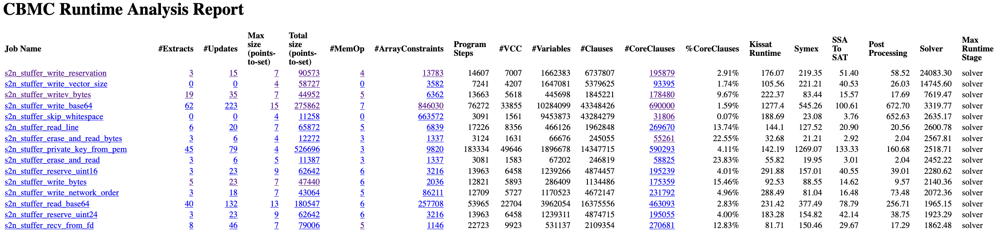
